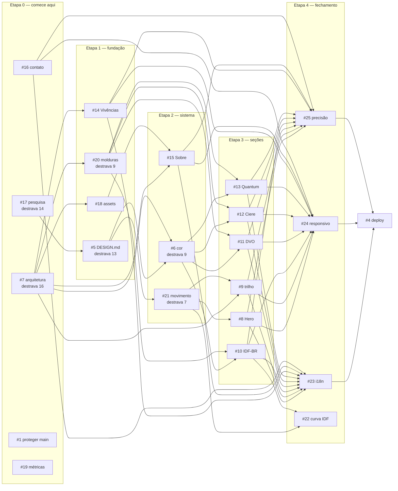

# Roadmap — etapas, paralelismo e caminho crítico

> **O objetivo é uma LP nova para substituir a que está em produção.**
> O arquivo em construção é `wireframes/lp-final.html`; a `develop` é onde ele
> é construído e testado. O `index.html` da raiz é o portfólio de 2024, não é
> usado, não é mantido e **não deve ser corrigido** — a issue #4 apaga ele.

As etapas **não são atribuídas na mão**. O workflow `painel` calcula do grafo de
dependências nativo do GitHub, a cada evento de issue:

> **etapa de uma issue = maior etapa dos bloqueadores + 1**
> Etapa 0 não depende de nada. **Tudo dentro de uma etapa é paralelizável por
> definição.**

O estado ao vivo está na issue **#29**, fixada no topo do repositório. Este
arquivo explica o *porquê* de cada dependência; o painel diz *onde estamos*.

**Profundidade: 6 etapas.** O painel na #29 tem a largura atual de cada uma.

---

## Etapa 0 — comece aqui · 4 em paralelo

| destrava | # | tarefa |
|---|---|---|
| **16** | **#7** | **arquitetura de seções: cortar 11 para 8** |
| **14** | **#17** | **pesquisa: fechar a lacuna da amostra de referências** |
| **4** | #16 | contato e footer |
| — | #19 | verificar ou remover as 3 métricas |

Infraestrutura concluída: **#1** proteção da `main`, **#2** CI de lint,
**#3** orçamento Lighthouse, **#28** favicon. E **#26**, que não deveria
ter existido — ver a lição no fim.

**#7 e #17 são as duas raízes, e juntas alimentam quase o projeto inteiro.**
Fazer as duas em paralelo é a única forma de encurtar o caminho crítico.

`destrava` conta dependentes **transitivos**. A diferença importa: contando só
dependente direto, a #17 aparentava alcance 1 — ela tem 1 direto (#5) e **14
transitivos**, porque `#17 → #5 → #6/#21 → todas as seções`.

A #19 não destrava nada: é folha.

## Etapa 1 — fundação · 5 em paralelo

| destrava | # | tarefa | espera |
|---|---|---|---|
| **13** | #5 | escrever o `DESIGN.md` | #17 |
| **9** | #20 | remover as 9 molduras vazias | #7 |
| 5 | #18 | os 4 assets que só o Augusto pode dar | #7 |
| 4 | #14 | **Vivências — Hut 8 e NIP** | #7 |

**A #14 está aqui, não na etapa das seções.** Ela só depende da arquitetura, e
por isso pode ser construída muito antes das outras seis. Eu tinha marcado ela
como etapa 3 na mão; o grafo corrigiu.

## Etapa 2 — sistema · 3 em paralelo

| destrava | # | tarefa | espera |
|---|---|---|---|
| **9** | #6 | isolamento cromático por subgrid | #5 · #7 |
| **7** | #21 | sistema de movimento e constante de duração | #5 |
| 4 | #15 | Sobre | #7 · #18 |

## Etapa 3 — seções · 6 em paralelo

| destrava | # | tarefa | espera |
|---|---|---|---|
| 5 | #10 | IDF-BR | #7 · #6 · #20 |
| 4 | #8 | Hero | #21 |
| 4 | #9 | trilho editorial | #7 · #21 |
| 4 | #11 | DVO | #7 · #6 · #20 |
| 4 | #12 | Ciere da Rosa | #7 · #6 · #20 |
| 4 | #13 | Quantum ML | #7 · #6 · #20 |

Seis frentes independentes entre si. É a etapa mais larga depois da 0, e a que
mais se beneficia de trabalho paralelo.

## Etapa 4 — fechamento · 4 em paralelo

| # | tarefa | espera |
|---|---|---|
| #23 | i18n PT/EN | todas as seções |
| #24 | responsivo de 320 a 3440px | todas as seções |
| #25 | auditoria de precisão de conteúdo | todas as seções |
| #22 | curva do IDF que se desenha | #21 · #10 |

## Etapa 5 — publicação · 1

| # | tarefa | espera |
|---|---|---|
| #4 | **promover a LP nova para a raiz**, apagando o portfólio de 2024 | #23 · #24 · #25 |

---

## O grafo



## Caminho crítico

```
#17 pesquisa → #5 DESIGN.md → #6 isolamento cromático → #10 IDF-BR
     → #23 / #24 / #25 fechamento → #4 publicação
```

Seis níveis. Nenhuma outra cadeia é mais longa, então **é este caminho que
define o prazo**. Atrasar qualquer elo dele atrasa o projeto inteiro; atrasar
uma issue fora dele não atrasa nada, desde que ela feche antes da etapa 4.

## Por que cada dependência existe

| dependência | motivo |
|---|---|
| #5 ← #17 | os tokens do `DESIGN.md` saem da pesquisa. Escrever antes seria registrar palpite como norma — e a pesquisa atual tem furo declarado: das seis referências medidas, só uma veio do cliente. |
| #6, #21 ← #5 | cor e movimento consomem tokens. Sem tokens, viram valor solto no CSS. |
| #20, #18, #14, #9, #6, #15 ← #7 | não se decide cor, moldura ou conteúdo de uma seção antes de saber quais seções existem. |
| #10–#13 ← #6 | os três produtos publicados carregam paleta real de projeto. A regra de contenção vem antes. |
| #10–#13 ← #20 | cada uma tem moldura vazia hoje. A regra de remoção vem antes de reconstruir. |
| #15 ← #18 | Sobre depende do retrato, e o retrato depende do Augusto. |
| #22 ← #21, #10 | a curva que se desenha precisa do sistema de movimento e da seção onde mora. |
| #23, #24, #25 ← todas as seções | i18n, responsivo e precisão só fazem sentido sobre a página inteira. |
| #4 ← #23, #24, #25 | publicar é o último passo. Nada vai a produção sem as três verificações. |

## Uma lição registrada

A **#26** consertava HTML quebrado no `index.html` em produção. Eu a criei e
priorizei achando que defeito no ar sempre vale corrigir.

**Estava errado, e o cliente corrigiu:** aquela página não é usada e vai ser
apagada pela #4. O conserto foi trabalho descartável, e pior — o CI estava
validando o arquivo errado, guardando o que não interessa em vez do produto.

O que ficou: o alvo do CI é **`wireframes/lp-final.html`**, e só ele. Antes de
criar issue sobre um arquivo, a pergunta é se ele sobrevive à #4.

## Estado da infraestrutura

- `main` — produção. GitHub Pages publica dela em modo `legacy`, direto da raiz.
- `develop` — **branch padrão do repositório** e onde a LP nova é construída.
  Precisa ter os workflows: evento de `issues` só dispara a partir da padrão.
- CI de lint no ar, com alvo em `wireframes/lp-final.html`: html-validate,
  stylelint, content-rules, paridade PT/EN. Os dois primeiros são **catracas**:
  reprovam só se o PR aumentar a contagem, e viram portão absoluto ao chegar a
  zero.
- CI de Lighthouse validado e verde.
- Painel automático calculando as etapas a cada evento de issue.
