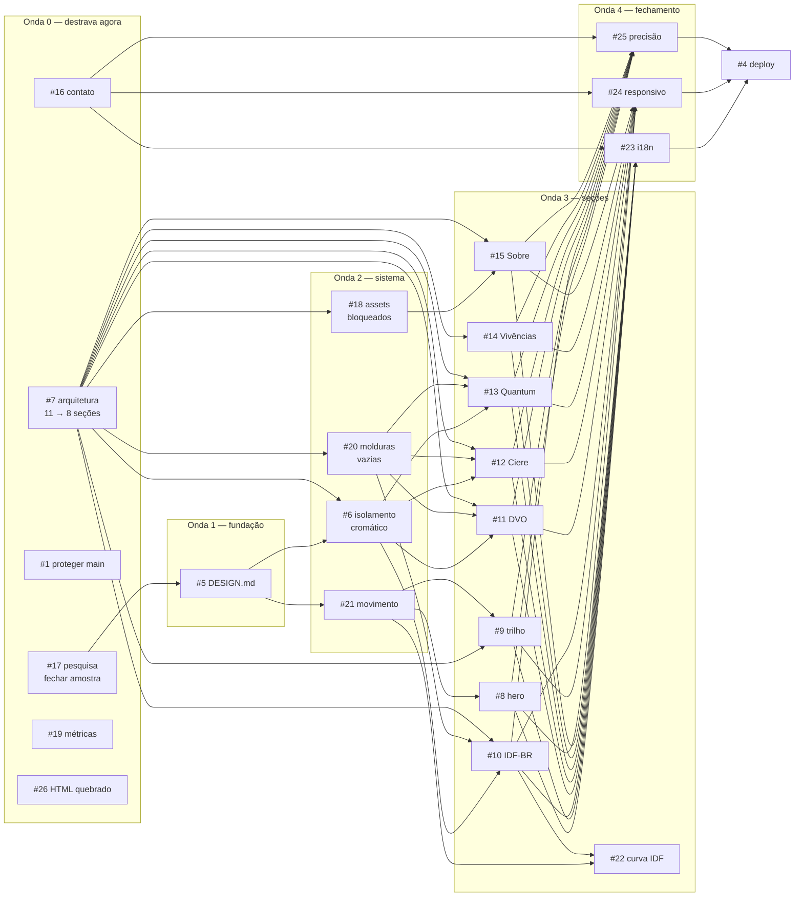

# Roadmap — ordem e dependências

As 26 issues estão organizadas em seis ondas. As dependências são **nativas do
GitHub** (`blocked by`), então uma issue bloqueada aparece marcada na própria
interface e não some da sua vista por engano.

## Comece por aqui — sete issues sem nenhum bloqueio

| # | tarefa | por que já dá para começar |
|---|---|---|
| **#7** | **arquitetura de seções: cortar 11 para 8** | **bloqueia outras 10 — é o gargalo do projeto** |
| **#17** | pesquisa: fechar a lacuna da amostra | raiz da outra cadeia; o `DESIGN.md` depende dela |
| #1 | proteger `main` | clique no Settings, independente de tudo |
| #16 | contato e footer | os destinos já são conhecidos; tira 10 erros do CI |
| #19 | verificar ou remover as 3 métricas | decisão de conteúdo, não depende de design |
| #26 | HTML quebrado no `index.html` | está em produção agora |
| #3 | orçamento Lighthouse | implementado, falta o primeiro PR para validar |

**Se for fazer só uma coisa, faça a #7.** Ela sozinha destrava #6, #9, #10, #11,
#12, #13, #14, #15, #18 e #20.

## O grafo



## Caminho crítico

```
#17 pesquisa → #5 DESIGN.md → #6 isolamento cromático → #10 IDF-BR
     → #23/#24/#25 fechamento → #4 publicação
```

Seis níveis de profundidade. Nada encurta esse caminho a não ser resolver a #17
e a #7 em paralelo, que é exatamente por que as duas estão na Onda 0.

## Por que cada dependência existe

| dependência | motivo |
|---|---|
| #5 ← #17 | os tokens do `DESIGN.md` saem da pesquisa. Escrever antes seria registrar palpite como norma. |
| #6, #21 ← #5 | cor e movimento consomem tokens. Sem os tokens, viram valor solto no CSS. |
| #6, #20, #18, #9, #14, #15 ← #7 | não dá para decidir cor, moldura ou conteúdo de uma seção antes de saber quais seções existem. |
| #10–#13 ← #6 | os três produtos publicados carregam paleta real de projeto. A regra de contenção precisa existir antes. |
| #10–#13 ← #20 | cada uma dessas seções tem moldura vazia hoje. A regra de remoção vem antes de reconstruir. |
| #15 ← #18 | a seção Sobre depende do retrato, e o retrato depende do Augusto. |
| #22 ← #21, #10 | a curva que se desenha precisa do sistema de movimento e da seção onde ela mora. |
| #23, #24, #25 ← todas as seções | i18n, responsivo e auditoria de precisão só fazem sentido sobre a página inteira. |
| #4 ← #23, #24, #25 | publicar é o último passo. Nada vai para produção sem as três verificações. |

## Uma tensão registrada

A **#26** — HTML quebrado no site que está no ar — está na Onda 0 e **sem
bloqueio de propósito**, embora a lógica dissesse que ela depende da #4.

O raciocínio: um `</spaN>` com maiúscula errada quebra a estrutura do documento
inteiro em produção **agora**, e o caminho crítico até a #4 tem seis níveis. Se
a substituição da página demorar, o site fica quebrado o tempo todo. Fica como
decisão consciente: corrigir agora custa pouco e pode virar trabalho perdido;
não corrigir mantém o defeito no ar.

## Estado da infraestrutura

- `main` — produção. GitHub Pages publica dela em modo `legacy`, direto da raiz.
- `develop` — integração, publicada.
- CI de lint no ar e rodando: html-validate, stylelint, content-rules, i18n.
- CI de Lighthouse implementado, aguardando o primeiro PR para ser validado.
